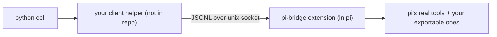

# pi-bridge

Call **pi's real tools** from code inside the pi repl — through a local unix
socket, invisibly. A client calling the read tool gets the same schema validation,
the same output shaping, and the same errors the model would get natively.
Clients are project-specific and none ships here: the socket speaks a tiny JSONL
protocol (below), and a helper for your tool subset is ~100 lines of stdlib Python.



Companion to the `pi-repl` extension, which replaces all of pi's tools with a
single Python cell. Zero changes to that package.

## How it works

- **The manifest is the surface.** `~/.pi/agent/pi-bridge/tools.yml` declares every
  callable tool: an import source (SDK package or `~/`/`./` file) plus an exported
  factory name. The engine is tool-name-blind — adding a tool is one YAML line.
- **The engine owns everything.** `index.ts` + `src/` load the manifest, mount
  pi's real tool factories, run a JSONL server, validate every call against the
  tool's real schema, execute with pi's real context, and format output host-side.
- **Clients are disposable.** The wire contract is three ops — ping, catalog,
  call — newline-framed JSON (see `src/protocol.ts`). A client that reads
  `PI_BRIDGE_SOCK`, handshakes, and returns text as-is is complete.

Reliability contract: cells only ever see (1) pi's verbatim schema errors,
(2) the tool's own failures, or (3) one loud message when a connection died
mid-call (which may have executed — never blindly retried). Connect-phase races
are retried invisibly. Everything else about the socket is unobservable.

## Install

```sh
# 1. the extension (this repo root IS the extension)
cp -R . ~/.pi/agent/extensions/pi-bridge    # or: ln -s "$PWD" ~/.pi/agent/extensions/pi-bridge

# 2. the manifest
mkdir -p ~/.pi/agent/pi-bridge
cp tools.yml.example ~/.pi/agent/pi-bridge/tools.yml   # then edit to taste
```

Start `pi --repl`. The bridge sets `PI_BRIDGE_SOCK` in the kernel's environment;
the catalog op lists what the manifest mounted.

## Manifest reference

| Field | Required | Meaning |
|---|---|---|
| `version` | yes | must be `1` |
| `tools[].from` | yes | package name, `~/` file, or `./` path relative to the manifest |
| `tools[].factory` | yes | exported function returning `{ name, execute }` |
| `tools[].cwd` | no | pass session cwd to the factory (SDK tools: `true`) |
| `tools[].name` | no | mount under a different name |
| `tools[].timeout` | no | per-tool call timeout in seconds |

Broken entries never take the bridge down: each failure is skipped with a precise
diagnostic (wrong path, missing export, garbage factory product, duplicate name),
and `pi.tools()` only shows what actually mounted.

## Declaring installed packages (npm or git)

`from:` can point at any file on disk, including a package pi installed for you.
Two layouts:

- **npm store** — `pi install npm:<pkg>` drops the package at
  `~/.pi/agent/npm/node_modules/<pkg>/`:

  ```yaml
    - from: "~/.pi/agent/npm/node_modules/@k3_2o/pi-read-image/index.ts"
      factory: createReadImageTool
      cwd: true
  ```

- **git checkout** — `pi install git:github.com/<owner>/<repo>@<ref>` clones into
  `~/.pi/agent/git/<host>/<owner>/<repo>/` with a production install run inside
  the checkout. Point `from:` at the checkout's entry file (same pattern). A
  checkout with no declared dependencies may have no `node_modules` at all.

One rule governs both:

- **The package must ship its runtime imports as real `dependencies`** (pi's
  documented rule for installed packages), not only `peerDependencies`. pi's
  production install never materializes peers, so the plain import chain from an
  installed copy finds only what physically sits next to it. A peers-only
  package fails with `Cannot find package '...'` — even though the identical
  file loads from `extensions/`, because loose files outside any npm project get
  bun's automatic fetch, while installed packages don't.

And one practical preference:

- **Use the `~/` path of the installed copy, not a bare package name.** A bare
  token resolves through bun's own machinery (it may pull a fresh copy from the
  registry cache instead of what you installed), so reference the file you
  actually have.

After adding an entry, `pi.tools()` in a fresh or `/reload`ed session shows it;
a skipped entry always has its reason on pi's stderr at boot.

## The protocol

| Op | Message | Reply |
|---|---|---|
| handshake | `{"v":1,"op":"ping"}` | `{"v":1,"op":"pong"}` |
| catalog | `{"v":1,"op":"catalog"}` | mounted tools: name, signature, description, source |
| call | `{"v":1,"op":"call","id":<uuid>,"tool":<name>,"params":{...}}` | clean text blocks, `details` hints (`truncated`/`nextOffset`), `isError` |

Errors arrive shaped: pi's verbatim schema message for bad args, the tool's own
message for failures, one loud message on mid-call connection loss (the call may
have executed — never blindly retry). A reference client lives in git history:
`git log --diff-filter=D -- examples/bridge.py`.

## Troubleshooting

- **`PI_BRIDGE_SOCK is not set`** — the extension did not activate: start pi with
  `--repl` (or `PI_REPL_FORCE=1`), and check stderr for `[pi-bridge]` diagnostics.
- **`protocol version mismatch`** — an old client met a new server (or vice versa);
  update the side that lags. Never silent by design.
- **`connection lost after the call was dispatched`** — the socket died mid-call;
  the call may have run, so re-issue deliberately rather than retrying blindly.
- **A tool is missing from the catalog** — its manifest entry was skipped; the
  exact reason is in pi's stderr at boot.
- **`Cannot find package '...'` for an npm store copy** — the package's runtime
  deps are not in the store; use a version that carries them as `dependencies`
  (see *Declaring npm-installed packages*).
- **Stale sockets** — swept automatically at every start (pid-liveness probe).

## Development

```sh
just setup   # bun install
just ci      # fmt + typecheck + lint + tests (incl. cross-language interop)
just e2e     # live gate: real pi, isolated HOME
just smoke   # extension imports cleanly
```

Requires bun 1.4+ (pi's own runtime).

## License

MIT
