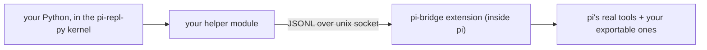

# pi-bridge

A companion to the pi-repl-py extension. pi-repl-py swaps all of pi's tools for
one: a Python kernel. You write Python in the repl; the model steps aside. But
the kernel is just a process, and pi's tools (read, bash, edit, the rest) live
behind a wall it cannot cross.

pi-bridge opens that wall. It is a second extension that loads pi's real tool
implementations and serves them over a local unix socket. Your Python calls
read and gets exactly what the model would get: same schema validation, same
host-side formatting, same errors. Nothing is reimplemented in Python.

A manifest (`~/.pi/agent/pi-bridge/tools.yml`) decides which tools exist and
where they come from; the engine is tool-name-blind, so adding one is a YAML
line. Helpers are per-project, and none ships here: the wire protocol is three
ops (ping, catalog, call; newline-framed JSON, see `src/protocol.ts`), and a
helper for your subset is about a hundred lines of stdlib Python.



## How it works

- **The manifest is the surface.** `~/.pi/agent/pi-bridge/tools.yml` declares
  every callable tool: an import source (SDK package or `~/`/`./` file) plus an
  exported factory name, the same contract pi's SDK tools follow. Adding a tool
  is one YAML line, and nothing else.
- **The engine owns everything.** `index.ts` + `src/` load the manifest, mount
  pi's real tool factories, run a JSONL server, validate every call against the
  tool's real schema, execute with pi's real context, and format output
  host-side.
- **Helpers are disposable.** Read `PI_BRIDGE_SOCK`, handshake, return text
  as-is. That is the whole job. Formatting, error shaping, and transport
  reliability happen inside pi, once, for every client.

Kernel code only ever sees three kinds of failure: pi's verbatim schema errors, the
tool's own failure text, or one loud message when the socket dies mid-call.
That last one is the honest catch: the call may have executed, so blind retries
are wrong. Connect-phase races are retried invisibly. Nothing else about the
transport is observable.

Side note for the curious: socket files are keyed by pid and swept at boot with
a `kill(pid, 0)` probe. A SIGKILLed pi leaves its 0-byte socket behind in a
private dir until the next boot clears it. Harmless. It reads like a
haunted house.

## Install

```sh
# 1. the extension (this repo root IS the extension)
cp -R . ~/.pi/agent/extensions/pi-bridge    # or: ln -s "$PWD" ~/.pi/agent/extensions/pi-bridge

# 2. the manifest
mkdir -p ~/.pi/agent/pi-bridge
cp examples/tools.yml ~/.pi/agent/pi-bridge/tools.yml   # then edit to taste
```

Start `pi --repl`. The bridge sets `PI_BRIDGE_SOCK` in the kernel's environment;
the catalog op lists what the manifest mounted. First boot creates
`~/.pi/agent/pi-bridge/run/` itself, 0700, so a fresh machine needs nothing.

## Manifest reference

| Field | Required | Meaning |
|---|---|---|
| `version` | yes | must be `1` |
| `tools[].from` | yes | package name, `~/` file, or `./` path relative to the manifest |
| `tools[].factory` | yes | exported function returning `{ name, execute }` |
| `tools[].cwd` | no | pass session cwd to the factory (SDK tools: `true`) |
| `tools[].name` | no | mount under a different name |
| `tools[].timeout` | no | per-tool call timeout in seconds |

Broken entries never take the bridge down: each failure is skipped with a precise
diagnostic: wrong path, missing export, garbage factory product, duplicate name.
The catalog only shows what mounted.

### What "exportable" means

`factory` is the name of a function the module named by `from:` must export.
At mount the bridge imports that module, calls the function once, and checks the
product's shape: a string `name` and an async `execute` that takes
`(toolCallId, params, signal, onUpdate, ctx)` and returns content blocks. That
is the exact contract pi's own SDK tools follow (`createReadTool`, `createBashTool`
and friends), which is why SDK tools and your own tools mount through the same
line of YAML and become indistinguishable in the catalog. `greet-tool.ts` below
is even written with pi's own `defineTool()` + typebox, the pattern the SDK docs
prescribe for `customTools` / `pi.registerTool()`: the bridge changes how a tool
is mounted, never how it is written.

`examples/greet-tool.ts` is a complete one:

```ts
export function createGreetTool() {
	return {
		name: "greet",
		parameters: {
			type: "object",
			properties: { name: { type: "string" } },
			required: ["name"],
		},
		async execute(_toolCallId, params) {
			return { content: [{ type: "text", text: `hello, ${params.name}` }] };
		},
	};
}
```

Mount it with:

```yaml
  - from: "~/my-tools/greet.ts"
    factory: createGreetTool
```

Write it once, the pi way: mount it in code or over YAML, it is the same object.

`parameters` is optional, but supply it and every call is schema-validated for
free: bad args get pi's verbatim validation message, and the catalog derives a
readable signature from the schema.

### Examples in this repo

- `examples/tools.yml`: a complete manifest, both `from:` rules shown
- `examples/greet-tool.ts`: the smallest exportable tool above, ready to mount
- `examples/skills/bridge-helper/`: a pi skill that writes a project helper for
  you and tests it against the live socket. Visit all three before writing
  anything from scratch.

## Declaring installed packages (npm or git)

`from:` can point at any file on disk. That includes a package pi installed for
you. Two layouts:

- **npm store**: `pi install npm:<pkg>` drops the package at
  `~/.pi/agent/npm/node_modules/<pkg>/`:

  ```yaml
    - from: "~/.pi/agent/npm/node_modules/@k3_2o/pi-read-image/index.ts"
      factory: createReadImageTool
      cwd: true
  ```

- **git checkout**: `pi install git:github.com/<owner>/<repo>@<ref>` clones into
  `~/.pi/agent/git/<host>/<owner>/<repo>/` with a production install run inside
  the checkout. Point `from:` at the checkout's entry file (same pattern). A
  checkout with no declared dependencies may have no `node_modules` at all.

One rule governs both:

- **The package must ship its runtime imports as real `dependencies`** (pi's
  documented rule for installed packages). pi's production install never
  materializes peers, so the plain import chain from an installed copy finds
  only what physically sits next to it. A peers-only
  package fails with `Cannot find package '...'`, even though the identical file
  loads from `extensions/`, because loose files outside any npm project get
  bun's automatic fetch, while installed packages don't.

And one practical preference:

- **Reference the installed file by its `~/` path.** A bare token resolves
  through bun's own machinery and may pull a fresh copy from the registry cache
  instead of the file you installed.

After adding an entry, the catalog in a fresh or `/reload`ed session shows it;
a skipped entry always has its reason on pi's stderr at boot.

## The protocol

| Op | Message | Reply |
|---|---|---|
| handshake | `{"v":1,"op":"ping"}` | `{"v":1,"op":"pong"}` |
| catalog | `{"v":1,"op":"catalog"}` | mounted tools: name, signature, description, source |
| call | `{"v":1,"op":"call","id":<uuid>,"tool":<name>,"params":{...}}` | clean text blocks, `details` hints (`truncated`/`nextOffset`), `isError` |

Errors arrive shaped: pi's verbatim schema message for bad args, the tool's own
message for failures, one loud message on mid-call connection loss. A reference
helper lives in git history: `git log --diff-filter=D -- examples/bridge.py`.

## Troubleshooting

- **`PI_BRIDGE_SOCK is not set`**: the extension did not activate. Start pi with
  `--repl` (or `PI_REPL_FORCE=1`), and check stderr for `[pi-bridge]`
  diagnostics.
- **`protocol version mismatch`**: an old client met a new server (or vice
  versa); update the side that lags. Never silent by design.
- **`connection lost after the call was dispatched`**: the socket died mid-call;
  the call may have run, so re-issue deliberately. Blind retries risk a double
  effect.
- **A tool is missing from the catalog**: its manifest entry was skipped; the
  exact reason is in pi's stderr at boot.
- **`Cannot find package '...'` for an npm store copy**: the package's runtime
  deps are not in the store; use a version that carries them as `dependencies`
  (see *Declaring npm-installed packages*).
- **Stale sockets**: swept automatically at every start (pid-liveness probe).

## Development

```sh
just setup   # bun install
just ci      # fmt + typecheck + lint + tests (incl. cross-language interop)
just e2e     # live gate: real pi, isolated HOME
just smoke   # extension imports cleanly
```

Requires bun 1.4+ (pi's own runtime). The e2e boots a real pi in a throwaway
HOME. That isolation was earned: we once ran a live gate against a working
session and wrecked it. Yours stays untouched.

## License

MIT
